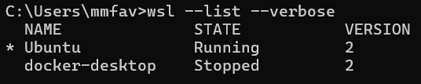

# 🐧Como Verificar e Instalar o WSL no Windows

## ✅ O que é o WSL?

O **WSL (Windows Subsystem for Linux)** é um recurso do Windows que permite executar distribuições Linux diretamente no Windows, sem necessidade de máquinas virtuais ou dual-boot.

---

## 📌 1. Verificando se o WSL está instalado

Para verificar se o WSL já está instalado no seu computador:

1. Pressione as teclas `⊞ Win + R`, digite `cmd` e pressione `Enter`.

2. No Prompt de Comando, execute:

```bash
wsl --list --verbose
```

Se uma lista de distribuições aparecer (como Ubuntu, Debian, Kali Linux), significa que o WSL já está instalado ✅.



3. Caso o comando não retorne resultados ou indique um erro, siga para a seção seguinte para instalar o WSL.

---

## 📥 2. Instalando o WSL

### 2.1. Verificando a versão do Windows

Para instalar o WSL, sua versão do Windows precisa ser compatível:

- **Windows 10** versão **19041** ou superior
- **Windows 11** (já possui suporte nativo ao WSL 2)

Para conferir a versão do Windows:

1. Pressione `⊞ Win + R`, digite `winver` e pressione `Enter`.
2. Verifique se a versão atende aos requisitos acima.

### 2.2. Instalação rápida (recomendado)

1. Pressione a tecla `⊞ Win`, digite `PowerShell`.
2. Clique com o botão direito no aplicativo e selecione **Executar como administrador** (este passo é obrigatório).
3. No PowerShell, execute o comando:

```powershell
wsl --install
```

> ⚠️ Após este comando, talvez seja necessário reiniciar o computador para concluir a instalação.

4. Após reiniciar, verifique se a instalação foi bem-sucedida:

```bash
wsl --list --verbose
```

Se as distribuições Linux aparecerem listadas, o WSL foi instalado corretamente ✅.

5. Para abrir sua distribuição, digite no terminal:

```bash
wsl
```

Siga as instruções na tela para completar o processo de configuração inicial.

---

## 🐧 3. Instalando uma Distribuição Linux (caso necessário)

Se o Ubuntu (ou outra distribuição Linux desejada) não foi instalado automaticamente:

1. Abra a **Microsoft Store**.
2. Pesquise pela distribuição **Ubuntu**
3. Clique em **Instalar**.
4. Após a instalação, abra o terminal (CMD ou PowerShell) e digite:

```bash
ubuntu
```

Sua distribuição estará pronta para uso!

---
**Instalação bem sucedida?**
✅ Agora você está pronto para usar o Linux diretamente do seu Windows! 🎉
✅ Volte para a [Instalação](../Instalação.md) e continue o processo.

**Instalação mal sucedida?**
❌ Não conseguiu instalar o wsl ou uma distribuição linux na sua máquina?
✅ Você pode acompanhar o curso com uma conta gratuita no [Preset](Preset.md)! 
