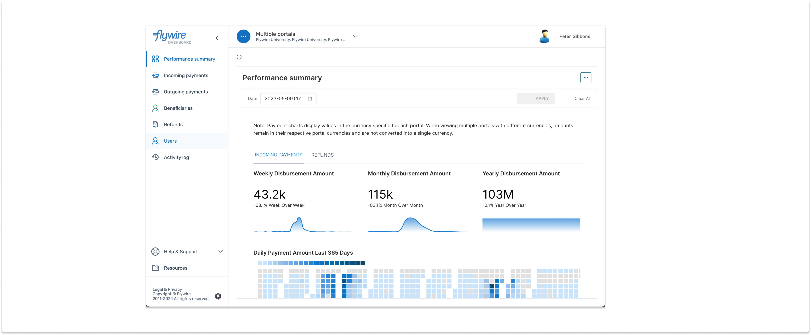
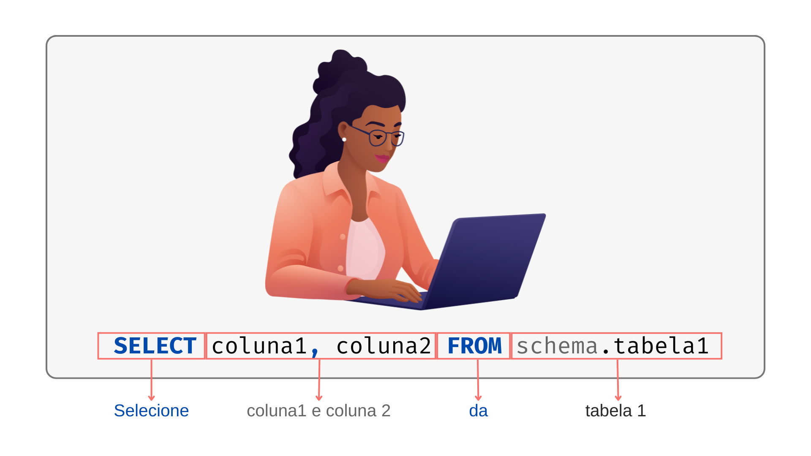
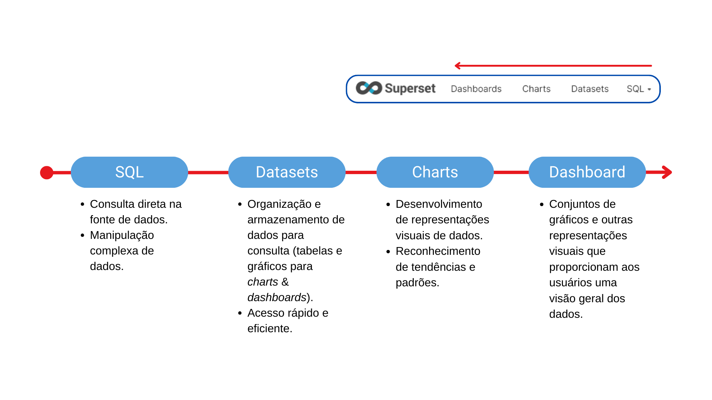
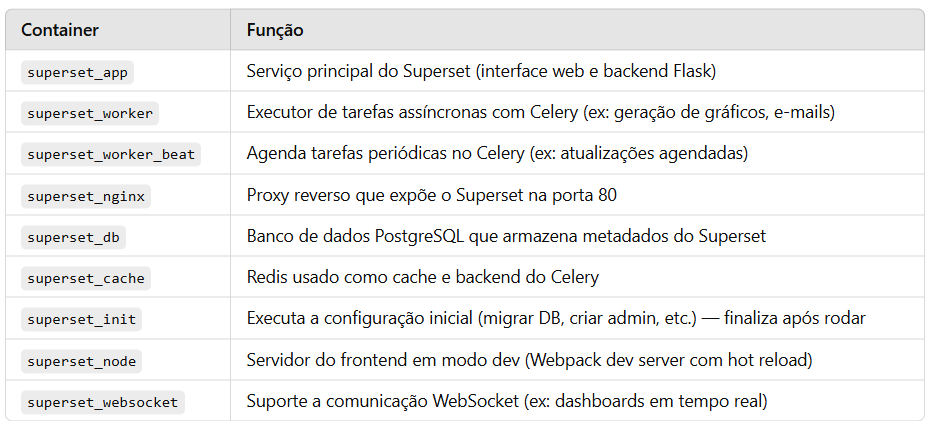
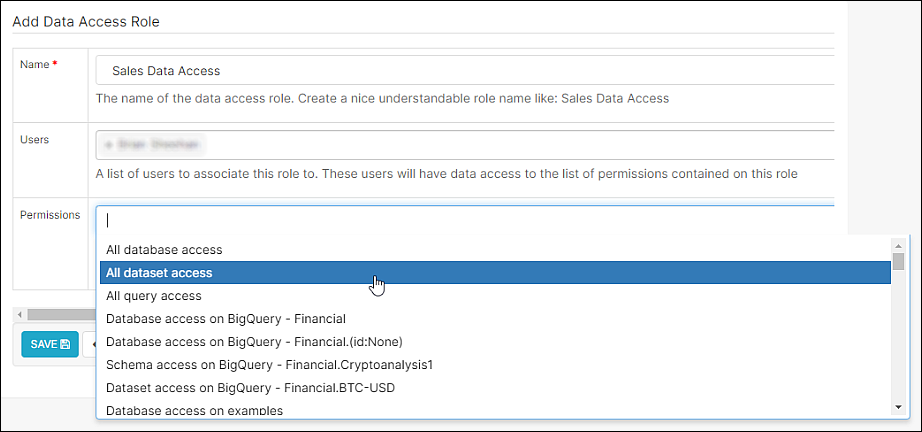
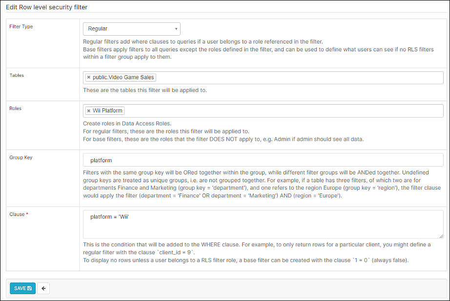
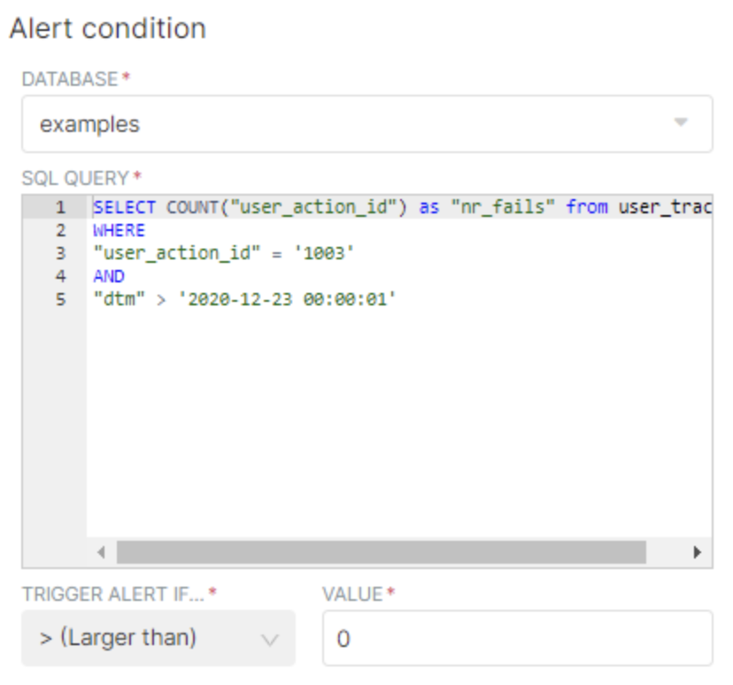
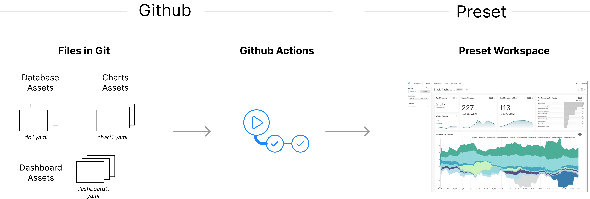
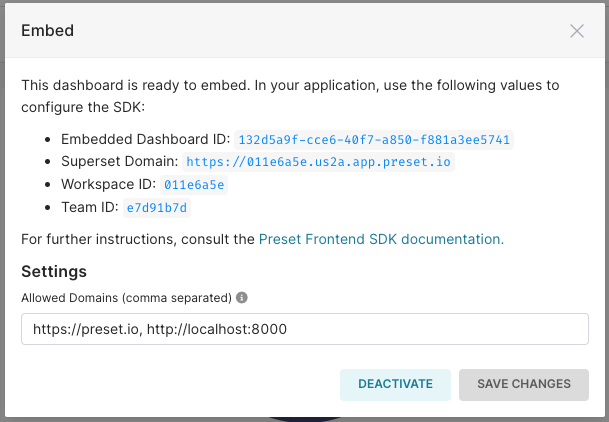

<!-- _class: first-slide -->

<small>🐍 84º Python Floripa</small>

# ==Apache Superset==

**Marília Melo Favalesso**

---
## <!-- fit --> Marília Melo Favalesso  


🧠 Desenvolvedora de IA | MSc | PhD

🐍 Python & Comunidades  

🐈 Gatos, pizza e bicicleta nas horas vagas
<br>
<small>📧 marilia.melo.favalesso@gmail.com</small>

<small>🔗 LinkedIn: [/mariliafavalesso](https://www.linkedin.com/in/mariliafavalesso/)</small>

<small>🔗 github: [/mmfava](https://github.com/mmfava)</small>

<small>🔗 site: [www.mariliafavalesso.com](https://github.com/mmfava)</small>

---
<!-- _class: first-slide -->


# "*Superseter by heart*"
<div class="linha"></div><br>

Entusiasta de ferramentas Open-Source 💙

---

## Agenda

<div style="display:grid;grid-template-columns:1fr 1fr">
<div>
<p>

1. Overview  
2. Arquitetura   
3. Funcionalidades
4. Instalação
5. Código


</p>
</div>

<div>
<p>

6. SQL Lab 
7. Datasets
8. Charts 
9. Dashboards e Filtros
10. Mão na Massa  

</p>
</div>
</div>


---
<!-- _class: first-slide -->


# Overview 
<div class="linha"></div><br>

O <b>Apache Superset</b> é uma <b>Ferramenta para Business Intelligence (BI)<br>open-source</b> que permite a exploração e visualização de dados de forma iterativa e escalável. 

---
## <!--- fit ---> Business Intelligence (BI)
<b><small>Inteligência de Negócios</small></b><br>


- Conjunto de processos, tecnologias e ferramentas que **coletam, organizam, analisam e visualizam dados**.
- Transforma dados dispersos em **informações úteis** e insights claros.
- Facilita decisões estratégicas, operacionais e táticas, permitindo ações rápidas e informadas.
- Ajuda gestores a entenderem rapidamente **o que está acontecendo e o porquê**.

<br>
<small>✨ O objetivo é o de apoiar decisões inteligentes e baseadas em fatos <br>✨~<b><u>Data-Driven</u></b>(DWx 2025)!</small>


---

## Apache Superset


<small><center><a href="https://www.techtarget.com/searchbusinessanalytics/definition/business-intelligence-architecture">Adaptado de Yasar & Pratt 2024 (techtaget)
</a></center></small>

---


---

<center>No <b>Apache Superset</b>, a análise e visualização de dados ocorrem a partir de <b>conjuntos de dados estruturados</b> – tabelas organizadas em <b>linhas e colunas</b> – extraídas de bancos de dados compatíveis com <b>SQL</b>.</center>

<br>


---

<center>Os dados são manipulados e sumarizados para compor <b>visualizações interativas e personalizadas</b>.<br>O <b>Apache Superset</b> oferece <b>mais de 40 tipos de gráficos e visualizações</b>.</center>


---

<center><b>Quando os datasets são atualizados na fonte original, o Apache Superset reflete essas mudanças de forma automática</b>, garantindo que as visualizações de dados estejam sempre atualizadas.</center><br>


---


<center>As visualizações geradas podem ser organizadas em <b>dashboards interativos</b>,<br>fornecendo uma visão abrangente dos dados com filtros, indicadores e relatórios dinâmicos.</center> <br> 


---

<center>Os <b>dashboards</b> podem incluir tabelas e gráficos personalizados,<br>ser exportados como <b>PDFs, imagens ou relatórios automatizados</b> e<br>compartilhados com equipes para acompanhamento de métricas.</center><br>


---



---

<br>
*Self-serve analytics* para **todos os níveis de usuários**!<br>Oferece um construtor de visualizações e customizações **sem código**.

---



---


<center>O <b>Apache Superset</b> oferece um sistema de permissões flexível, permitindo a definição de <b>diferentes perfis de usuários</b>, cada um com níveis de acesso e funcionalidades personalizáveis, garantindo controle granular sobre a plataforma.</center><br>

---

<center>A ferramenta é um projeto de <b>código aberto (<i>open-source</i>)</b> e se beneficia de uma grande<br>comunidade de desenvolvedores e usuários que contribuem para a sua melhoria contínua.</center><br>


---
### Workflow


---
### Menu



---

# História


**Max Beauchemin**

 - Projeto de hackathon no Airbnb (2015) cujo objetivo era a criação de uma ferramenta para a visualização de dados em código aberto.
 - Cresceu rapidamente e superou o Tableau como principal solução de visualização de dados do Airbnb.
 - Em 2016, Superset tornou-se um projeto de código aberto completo, incubado pela Apache Software Foundation.
 - Empresas como Airbnb, Lyft e Twitter (X) são usuários corporativos do Superset.

<br> <div style="border: 1px solid #ccc; padding: 15px; padding-left:60px; font-size: 0.7em; background-color: #f8f8f8;"> Maxime criou o **Apache Superset** para superar as limitações do **Tableau** no Airbnb, que não suportava **Presto** e **Druid**, além de ser caro e pouco escalável. O objetivo era desenvolver uma solução **open-source**, flexível e acessível para análise e visualização de dados. [🔗](https://maximebeauchemin.medium.com/the-future-of-business-intelligence-is-open-source-9b654595773a)</div>


---
<!-- _class: first-slide -->


# Arquitetura
<div class="linha"></div><br>

O Apache Superset foi projetado para <b>escalar de forma flexível junto ao seu negócio</b>. E quando você se sentir confiante no básico, há diversas maneiras de explorar ainda mais todo o potencial da ferramenta.

---


<center>Uma instalação típica do Superset é composta pelos componentes ilustrados.</center>

---

### Docker Compose



---
## Configurar Identidade Visual

Você pode por exemplo adicionar o logo da CERTI ou do cliente alterando as configurações para apontar para a logo customizada:

```python
APP_NAME = "Fundação CERTI"
APP_ICON = "/static/assets/images/certi-logo.png"
APP_ICON_WIDTH = 200  # Ajuste o tamanho conforme o necessário
LOGO_TARGET_PATH = '/' 
LOGO_TOOLTIP = 'CERTI Painel Sinóptico'

FAVICONS = [{"href": "/static/assets/images/certi-favicon.png"}]
```

==Garanta que as imagens estão no repositório configurado.==

---

==Slide com superset no estilo CERTI==

---
### Vantagens 

► **Escalável:** fácil de crescer, só adicionar mais servidores
► **Rápido:** usa **Redis (caching)** para acelerar consultas
► **Robusto:** tarefas pesadas rodam separadas, sem travar o sistema
► **Conectável:** funciona com vários bancos de dados via SQLAlchemy
► **Gratuito**: ==Licença Apache 2.0== permite uso comercial sem custos.
► **Governança**: Conecta com a autenticação de usuários da empresa, como AD e Keycloak.

Ideal para empresas que precisam de **desempenho** e **crescimento fácil**.


---

## Fontes de dados

  

A ferramenta se conecta a diversas fontes de dados compatíveis com **SQL**, incluindo **Presto, Trino, Athena e muitos outros**.  
<small>
✅ Suporte a **bancos relacionais e data warehouses**  
✅ Utiliza **SQLAlchemy** para abstração e integração com diferentes bancos de dados.
</small>

<!-----
<small>

✅ **Suporte a bancos relacionais e data warehouses**

> O Superset funciona com sistemas de banco de dados transacionais (como PostgreSQL, MySQL, SQL Server) e também com data warehouses e engines de consulta analítica (como BigQuery, Snowflake, Redshift, etc).

✅ **Compatibilidade depende de driver Python DB-API**

> Para se conectar a um banco, o Superset precisa que exista um driver Python compatível com o padrão **DB-API 2.0**. Esse driver é o responsável por permitir a comunicação entre o Superset (via Python) e o banco de dados.

✅ **Utiliza SQLAlchemy para abstração e integração**

> O SQLAlchemy é uma biblioteca Python que o Superset usa para abstrair a conexão com os diferentes bancos. Assim, o Superset consegue falar com múltiplas bases de dados, sem precisar de código específico para cada uma delas — o SQLAlchemy e os drivers fazem esse trabalho nos bastidores.

</small>

-----> 

---
<!-- _class: first-slide -->


# Funcionalidades
<div class="linha"></div><br>

"*Open-source* é uma abordagem superior para criar e distribuir software porque fornece garantias importantes sobre como o software pode ser descoberto, testado, operado, colaborado e empacotado."
<small>Maxime Beauchemin (2021)[🔗](https://maximebeauchemin.medium.com/the-future-of-business-intelligence-is-open-source-9b654595773a)</small>

---
### RBAC (Role-Based Access Control)

*Controle de acesso baseado em funções*

Define **o que o usuário pode ver e fazer**, de acordo com seus **papéis (roles)**.

**Exemplos de permissões:**  
► Ver dashboards  
► Editar datasets  
► Executar SQL  
► Gerenciar usuários

**Como funciona**
- Roles padrão: _Admin_, _Alpha_, _Gamma_
- Possível criar roles personalizados
- Usuários podem ter múltiplos roles

---



---
### RLS (Row-Level Security)

*Segurança em nível de linha*

Restringe **quais dados o usuário pode ver**, aplicando **filtros por linha**.

**Exemplo:**  
João vê só dados da região **Sudeste**,  
Maria vê apenas da **Região Sul**.
```plsql
WHERE regiao IN ('sul')
```
**Como funciona**
- Filtros criados em _Security > Row Level Security_
- Associados a datasets e roles
- Aplicados automaticamente nas queries

---

### Row Level Security (RLS)

Segurança em nível de linha (RLS)



---

### SSO (Single Sign-On)

_Acesso único para múltiplos sistemas_

Permite que o usuário **faça login uma única vez** para acessar várias ferramentas (ex: Superset, Slack, Drive).

**Como funciona:**
► Integração com um provedor de identidade (ex: Google, Azure AD, Okta)
► Autenticação centralizada e segura

**Vantagens:**  
Menos senhas, mais segurança  e melhor experiênciass

---

### Alertas e Relatórios


► Cria relatórios de forma automática
► Notificações via email ou Slack
► Gatilhos com consultas SQL


---

## Jinja

_Template para consultas eficientes_

► Variáveis para **parametrizar** filtros
► **Reutilize** e simplifique consultas SQL  
► Para análises **iterativas** e **complexas**

<br>


---
### Grupos


---

### Importar / Exportar

_Migração e versionamento de dados no Superset_

► Compartilhe dashboards e datasets  
► Suporte a CSV, Excel, JSON, YAML  
► Migração entre instâncias  
► Versionamento em código

**Usos comuns:**  
Backup, migração, compartilhamento e CI/CD

---



---

### Embed

_Incorpore em outras aplicações_

► Geração de **links embed** 
► Portais, intranets e aplicações web  

**Exemplos de uso:**  
Portais corporativos, sistemas internos, relatórios interativos



---

## Outros 


► Maptools
► Handlebars
► Thumbnails
► ...

Consulte a documentação oficial, em configurações!


---

## Funcionalidades opcionais

Algumas funcionalidades adicionais do Apache Superset dependem da ativação de componentes auxiliares, como a **camada de cache**. 

Por exemplo, os **alertas e relatórios automatizados** e as **miniaturas (thumbnails) dos dashboards**.

<br>

⚠️ Já habilitado com o docker-compose!


---
<!-- _class: first-slide -->


# Instalação
<div class="linha"></div><br>

 *The fastest way to try Superset locally is using Docker Compose on a Linux or Mac OSX computer. Superset does not have official support for Windows* (documentação oficial [🔗](https://superset.apache.org/docs/installation/docker-compose))


---

## Docker

A comunidade Apache Superset usa extensivamente o <b>Docker</b> para desenvolvimento, lançamento e produção do Superset.

<br>
**Docker-compose**:
<small>Template para versão de desenvolvimento e para produção.</small>


---


---

<!-- _class: first-slide -->


# Código e Ferramenta
<div class="linha"></div><br>

"*The Future of Business Intelligence is Open Source*"
<small>Maxime Beauchemin (2021)[🔗](https://maximebeauchemin.medium.com/the-future-of-business-intelligence-is-open-source-9b654595773a)</small>

---

# Referências

► **Preset (ferramenta baseada em Superset)**  
    [https://docs.preset.io](https://docs.preset.io/)
► **Documentação oficial do Apache Superset**  
    [https://superset.apache.org/docs/](https://superset.apache.org/docs/)
► **Repositório no GitHub (Apache Superset)**  
    [https://github.com/apache/superset](https://github.com/apache/superset)
► **Docker e Docker Compose**  
    [https://docs.docker.com/engine/install/ubuntu/](https://docs.docker.com/engine/install/ubuntu/)
► **Artigo do criador do Superset (Max Beauchemin)**  
    ["The Future of Business Intelligence is Open Source" – Medium](https://maximebeauchemin.medium.com/the-future-of-business-intelligence-is-open-source-9b654595773a)

---
<!-- Texto Principal -->
<div class="texto-principal">Obrigada!</div>

<!-- Linha Divisória -->
<div class="linha"></div>
<div class="contato">
  <b>Marília Melo Favalesso - PhD, Cientista de Dados<b>
</div>

<!-- Redes Sociais -->
<div class="redes-sociais">
  <a href="https://www.linkedin.com/in/seuusuario" target="_blank">🔗 LinkedIn: /mariliafavalesso</a>
  <a href="mailto:seuemail@example.com">✉️ Email: marilia.melo.favalesso@gmail.com</a>
</div>
