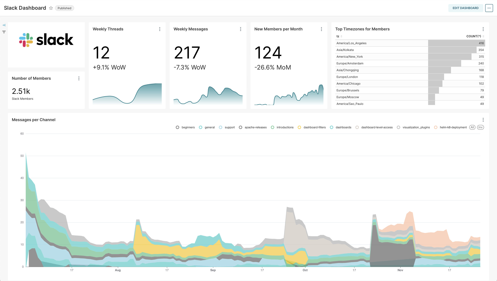

<!-- _class: first-slide -->

<small>🐍 84º Python Floripa</small>

# ==Apache Superset==

**Marília Melo Favalesso**

---
## <!-- fit --> Marília Melo Favalesso  


🧠 Cientista de Dados | MSc | PhD

🐍 Python & Comunidades  

🐈 Gatos, pizza e bicicleta nas horas vagas
<br>
<small>📧 marilia.melo.favalesso@gmail.com</small>

<small>🔗 LinkedIn: [/mariliafavalesso](https://www.linkedin.com/in/mariliafavalesso/)</small>

<small>🔗 github: [/mmfava](https://github.com/mmfava)</small>

---

## Agenda


<div style="display:grid;grid-template-columns:1fr 1fr">
<div>
<p>

1. Introdução (O que é Superset, vantagens, casos de uso, história)
2. Implantação e Configuração
3. Conectando Bancos de Dados
4. Criando Datasets
5. Criando Gráficos e Dashboards


</p>
</div>

<div>
<p>

6. Publicação e compartilhamento de visualizações
7. SQL Lab e Consultas Avançadas
8. Agendamento de Relatórios e Alertas
9. Segurança e Controle de Acesso
10. Personalização e API


</p>
</div>


</div>

---
<!-- _class: first-slide -->


# Overview 
<div class="linha"></div><br>

O <b>Apache Superset</b> é uma <b>Ferramenta de Business Intelligence (BI)<br>open-source</b> que permite a exploração e visualização de dados de forma iterativa e escalável. 

---


---

<center>No <b>Apache Superset</b>, a análise e visualização de dados ocorrem a partir de <b>conjuntos de dados estruturados</b> – tabelas organizadas em <b>linhas e colunas</b> – extraídas de bancos de dados <b>SQL compatíveis</b>.</center>

<br>


---

<center><b>Sempre que os datasets são atualizadas na fonte de dados original, o Apache Superset reflete essas mudanças automaticamente</b>, garantindo que os dados sempre atualizados.</center><br>


---

<center>Os dados das tabelas podem ser manipulados e transformados para compor <b>visualizações interativas e personalizadas</b>.<br>O <b>Apache Superset</b> oferece <b>mais de 40 tipos de gráficos e visualizações</b>.</center>


---

<center>As visualizações geradas podem ser organizadas em <b>dashboards interativos</b>,<br>fornecendo uma visão abrangente dos dados com filtros, indicadores e relatórios dinâmicos.</center> <br> 


---

<center>Os <b>dashboards</b> podem incluir tabelas e gráficos personalizados,<br>ser exportados como <b>PDFs, imagens ou relatórios automatizados</b> e<br>compartilhados com equipes para acompanhamento de métricas.</center><br>


---

<br>

*Self-serve analytics* para **todos os níveis de usuários**!<br>Oferece um construtor de visualizações e customizações **sem código**.

---


<center>O <b>Apache Superset</b> oferece um sistema de permissões flexível, permitindo a definição de <b>diferentes perfis de usuários</b>, cada um com níveis de acesso e funcionalidades personalizáveis, garantindo controle granular sobre a plataforma.</center><br>

---

<center>A ferramenta é um projeto de <b>código aberto (<i>open-source</i>)</b> e se beneficia de uma grande<br>comunidade de desenvolvedores e usuários que contribuem para a sua melhoria contínua.</center><br>


<!----
- O Apache Superset é um projeto de código aberto, o que significa que está disponível gratuitamente para uso e modificação. Isso permite que as organizações personalizem a ferramenta para atender às suas necessidades específicas sem incorrer em custos de licenciamento associados a ferramentas proprietárias de BI (Thomsen & Pedersen, 2005).
- Sendo de código aberto, ele se beneficia de uma grande comunidade de desenvolvedores e usuários que contribuem para sua melhoria contínua e expansão de recursos(Thomsen & Pedersen, 2009).
---> 

---
<!-- _class: first-slide -->


# História
<div class="linha"></div><br>

"*The Future of Business Intelligence is Open Source*"
<small>Maxime Beauchemin (2021)[🔗](https://maximebeauchemin.medium.com/the-future-of-business-intelligence-is-open-source-9b654595773a)</small>

---

## *How it start*


 - 2015 → Criado no Airbnb por **Maxime Beauchemin** 
 - 2017 → Entrou no Apache Incubator
 - 2020 → Top-Level Project (TLP) da Apache Software Foundation
 - 2021 → V1.0, consolidando-se como solução madura de BI

<br> <div style="border: 1px solid #ccc; padding: 15px; padding-left:60px; font-size: 0.7em; background-color: #f8f8f8;"> Maxime criou o **Apache Superset** para superar as limitações do **Tableau** no Airbnb, que não suportava **Presto** e **Druid**, além de ser caro e pouco escalável. O objetivo era desenvolver uma solução **open-source**, flexível e acessível para análise e visualização de dados. [🔗](https://maximebeauchemin.medium.com/the-future-of-business-intelligence-is-open-source-9b654595773a)</div>


<!----
​O **Apache Superset** é uma plataforma de exploração e visualização de dados que teve origem na Airbnb em 2015. Criado por Maxime Beauchemin, também responsável pelo Apache Airflow, o projeto começou como uma iniciativa interna para permitir que os usuários analisassem e visualizassem dados de forma eficiente. ​[medium.com](https://medium.com/%40dblancbellido/unveiling-the-power-of-apache-superset-a-modern-data-exploration-and-visualization-platform-d302a82e5296)[ru.wikipedia.org+6fr.wikipedia.org+6de.wikipedia.org+6](https://fr.wikipedia.org/wiki/Apache_Superset)

Em 2017, o Superset entrou no programa Apache Incubator, marcando o início de sua jornada como um projeto de código aberto sob a égide da Apache Software Foundation (ASF). Durante esse período, empresas como Lyft e Dropbox contribuíram significativamente para o desenvolvimento da ferramenta. ​[ru.wikipedia.org+2en.wikipedia.org+2github.com+2](https://en.wikipedia.org/wiki/Apache_Superset)

Em janeiro de 2021, o Superset alcançou o status de Top-Level Project na ASF, reconhecendo sua maturidade e importância na comunidade de software de código aberto. ​[ru.wikipedia.org+3de.wikipedia.org+3en.wikipedia.org+3](https://de.wikipedia.org/wiki/Apache_Superset)

Atualmente, o Apache Superset é utilizado por diversas empresas líderes no setor de tecnologia, incluindo Airbnb, Lyft e Twitter, destacando-se como uma solução robusta para visualização e exploração de dados em larga escala. ​[preset.io](https://preset.io/about/).

Maxime escreveu em seu blog que os motivos que o levaram a desenvolver o **Apache Superset** foram a necessidade de uma ferramenta open-source de BI que fosse escalável, extensível e capaz de suportar bancos de dados modernos como **Presto e Druid**. Na época, o **Tableau**, que era utilizado no Airbnb, não conseguia atender a esses requisitos, apresentava dificuldades na manipulação de grandes volumes de dados e ainda exigia licenciamento pago, limitando o acesso dos colaboradores. Dessa forma, o **Superset** nasceu para oferecer uma solução flexível, intuitiva e acessível para análise e visualização de dados. 

--->

---
## *Same, but different*

✅ **Nativamente compatível com bancos SQL modernos** (Presto, Trino, BigQuery)  
✅ **Escalável para Big Data**, sem dependência de extrações (Apache Druid) 
✅ **Livre de limitações de licenciamento** e usuários concorrentes  
✅ **Cloud-native e flexível**, sem dependência de Windows  
✅ **Extensível e personalizável**, suportando plugins e integrações
✅ **Comunidade ativa e crescente** com atualizações frequentes e suporte colaborativo


---
## *How its going*

1. Se tornou a **plataforma de BI open-source mais popular no mundo**  
2. **Adotado por milhares de empresas**, incluindo grandes players de tecnologia  
3. **Liderança em inovação** → Novo roadmap inclui **AI, performance e usabilidade**  
4. **Maturidade comprovada** → Apache Top-Level Project + versão 4.0 em evolução

<br>
<div style="border: 1px solid #ccc; padding: 15px; padding-left:60px; font-size: 0.7em; background-color: #f8f8f8;">
Utilizado por diversas empresas líderes no setor de tecnologia, incluindo Airbnb e X (Twitter),<br>destacando-se como uma solução escalável e de alto desempenho para visualização e<br>exploração de dados em larga escala. 
</div>


---



---

## Databases

  

A ferramenta se conecta a diversas fontes de dados compatíveis com **SQL**, incluindo **Presto, Trino, Athena e muitos outros**.  
<small>
✅ Suporte a **bancos relacionais e data warehouses**  
✅ Compatibilidade depende de **driver Python DB-API**  
✅ Utiliza **SQLAlchemy** para abstração e integração
</small>


---
## 🛠️ Desenvolvimento  

```{python}
a = 1 
print(a)
```

---
##  Conclusão ou Insight Final  

Lorem Ipsum Lorem Ipsum Lorem Ipsum Lorem Ipsum Lorem Ipsum Lorem Ipsum Lorem Ipsum Lorem Ipsum Lorem Ipsum Lorem Ipsum Lorem Ipsum Lorem Ipsum Lorem Ipsum Lorem Ipsum Lorem Ipsum  

---
## 📣 Chamada para Ação (Opcional)  

Lorem Ipsum Lorem Ipsum Lorem Ipsum Lorem Ipsum Lorem Ipsum Lorem Ipsum Lorem Ipsum Lorem Ipsum Lorem Ipsum Lorem Ipsum Lorem Ipsum Lorem Ipsum Lorem Ipsum Lorem Ipsum Lorem Ipsum  


---
### 📥 <br> Referências 

Maxime Beauchemin (2021) - [The Future of Business Intelligence is Open Source](https://maximebeauchemin.medium.com/the-future-of-business-intelligence-is-open-source-9b654595773a). Medium. Acessado em 03 de março de 2025. 

---
<!-- Texto Principal -->
<div class="texto-principal">Obrigada!</div>

<!-- Linha Divisória -->
<div class="linha"></div>
<div class="contato">
  <b>Marília Melo Favalesso - PhD, Cientista de Dados<b>
</div>

<!-- Redes Sociais -->
<div class="redes-sociais">
  <a href="https://www.linkedin.com/in/seuusuario" target="_blank">🔗 LinkedIn: /mariliafavalesso</a>
  <a href="mailto:seuemail@example.com">✉️ Email: marilia.melo.favalesso@gmail.com</a>
</div>
