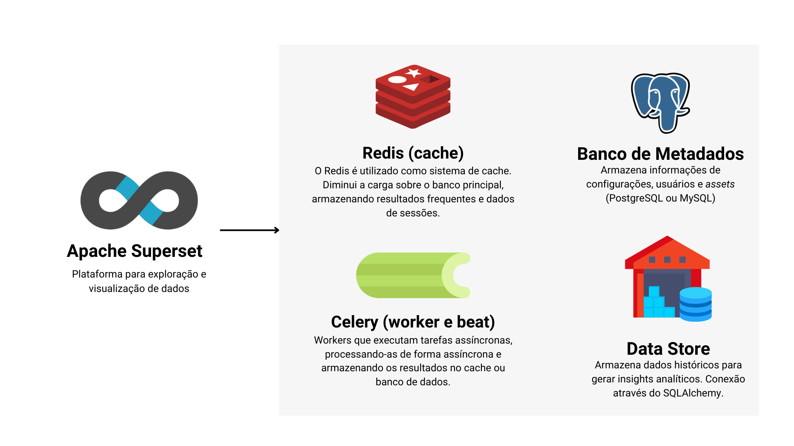
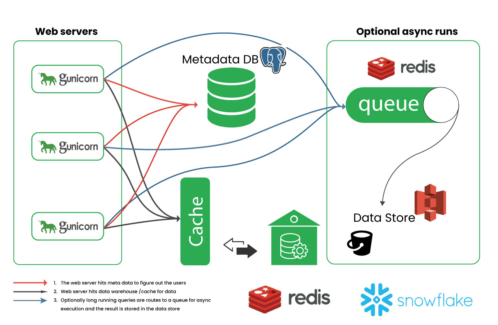
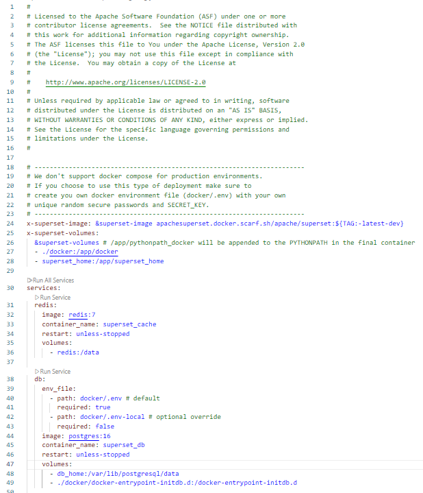
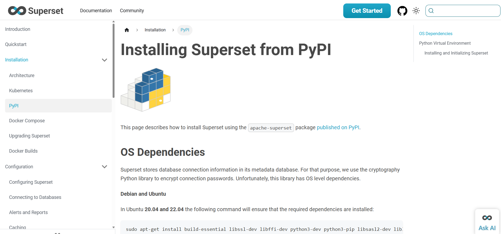

<!-- _class: first-slide -->

<small>🐍 84º Python Floripa</small>

# ==Apache Superset==

**Marília Melo Favalesso**

---
## <!-- fit --> Marília Melo Favalesso  

🧠 Desenvolvedora de IA | MSc | PhD

🐍 Python & Comunidades  

🐈 Gatos, pizza e bicicleta nas horas vagas
 
<small>📧 marilia.melo.favalesso@gmail.com</small>

<small>🔗 LinkedIn: [/mariliafavalesso](https://www.linkedin.com/in/mariliafavalesso/)</small>

<small>🔗 github: [/mmfava](https://github.com/mmfava)</small>

<small>🔗 site: [www.mariliafavalesso.com](https://github.com/mmfava)</small>

---
<!-- _class: first-slide -->

# "*Superseter by heart*"

 

Entusiasta de ferramentas Open-Source 💙

---

## Agenda

1. Overview  
2. Arquitetura   
3. Funcionalidades
4. Instalação
5. Código

6. SQL Lab 
7. Datasets
8. Charts 
9. Dashboards e Filtros
10. Mão na Massa  

---
<!-- _class: first-slide -->

# Overview 

 

O <b>Apache Superset</b> é uma <b>Ferramenta para Business Intelligence (BI) open-source</b> que permite a exploração e visualização de dados de forma iterativa e escalável. 

---
## <!--- fit ---> Business Intelligence (BI)
<b><small>Inteligência de Negócios</small></b> 

- Conjunto de processos, tecnologias e ferramentas que **coletam, organizam, analisam e visualizam dados**.
- Transforma dados dispersos em **informações úteis** e insights claros.
- Facilita decisões estratégicas, operacionais e táticas, permitindo ações rápidas e informadas.
- Ajuda gestores a entenderem rapidamente **o que está acontecendo e o porquê**.

 
<small>✨ O objetivo é o de apoiar decisões inteligentes e baseadas em fatos  ✨~<b><u>Data-Driven</u></b>(DWx 2025)!</small>

---

## Apache Superset

<small>
<a href="https://www.techtarget.com/searchbusinessanalytics/definition/business-intelligence-architecture">Adaptado de Yasar & Pratt 2024 (techtaget)
</a>
</small>

---

---

No <b>Apache Superset</b>, a análise e visualização de dados ocorrem a partir de <b>conjuntos de dados estruturados</b> – tabelas organizadas em <b>linhas e colunas</b> – extraídas de bancos de dados compatíveis com <b>SQL</b>.

 

---

Os dados são manipulados e sumarizados para compor <b>visualizações interativas e personalizadas</b>. O <b>Apache Superset</b> oferece <b>mais de 40 tipos de gráficos e visualizações</b>.

---

<b>Quando os datasets são atualizados na fonte original, o Apache Superset reflete essas mudanças de forma automática</b>, garantindo que as visualizações de dados estejam sempre atualizadas.
 

---

As visualizações geradas podem ser organizadas em <b>dashboards interativos</b>, fornecendo uma visão abrangente dos dados com filtros, indicadores e relatórios dinâmicos.
   

---

Os <b>dashboards</b> podem incluir tabelas e gráficos personalizados, ser exportados como <b>PDFs, imagens ou relatórios automatizados</b> e compartilhados com equipes para acompanhamento de métricas.
 

---

 
*Self-serve analytics* para **todos os níveis de usuários**! Oferece um construtor de visualizações e customizações **sem código**.

---

O <b>Apache Superset</b> oferece um sistema de permissões flexível, permitindo a definição de <b>diferentes perfis de usuários</b>, cada um com níveis de acesso e funcionalidades personalizáveis, garantindo controle granular sobre a plataforma.
 

---

A ferramenta é um projeto de <b>código aberto (<i>open-source</i>)</b> e se beneficia de uma grande comunidade de desenvolvedores e usuários que contribuem para a sua melhoria contínua.
 

---
### Workflow

---

# História

 - Projeto de hackathon no Airbnb (2015) cujo objetivo era a criação de uma ferramenta para a visualização de dados em código aberto.
 - Cresceu rapidamente e superou o Tableau como principal solução de visualização de dados do Airbnb.
 - Em 2016, Superset tornou-se um projeto de código aberto completo, incubado pela Apache Software Foundation.
 - Empresas como Airbnb, Lyft e Twitter (X) são usuários corporativos do Superset.

  
 Maxime criou o **Apache Superset** para superar as limitações do **Tableau** no Airbnb, que não suportava **Presto** e **Druid**, além de ser caro e pouco escalável. O objetivo era desenvolver uma solução **open-source**, flexível e acessível para análise e visualização de dados. [🔗](https://maximebeauchemin.medium.com/the-future-of-business-intelligence-is-open-source-9b654595773a)

---
<!-- _class: first-slide -->

# Arquitetura

 

"Como o Superset é de código aberto e o Airbnb contribui ativamente para o projeto, eles conseguiram turbinar o Superset com componentes internos com relativa facilidade."
<small>Maxime Beauchemin (2021)[🔗](https://maximebeauchemin.medium.com/the-future-of-business-intelligence-is-open-source-9b654595773a)</small>

---

Uma instalação típica do Superset é composta pelos componentes ilustrados.

<!-----

**1. Web Servers (Gunicorn):**

- O Superset utiliza servidores web Gunicorn para atender requisições dos usuários.
    
- Geralmente há vários servidores Gunicorn rodando simultaneamente para distribuir o tráfego e garantir escalabilidade.

### Fluxo Básico de Funcionamento:

1. **Requisição inicial:**
    
    - O usuário acessa o Superset através de um navegador.
    - O servidor web Gunicorn recebe a solicitação e consulta o Metadata DB para autenticação e identificação das permissões do usuário.

2. **Consulta de Dados:**
    
    - Após a autenticação, o Gunicorn consulta primeiro o cache (Redis) para verificar se os resultados solicitados já estão armazenados.
    - Se não houver cache, o Gunicorn realiza consultas diretas ao Data Store (banco externo) e guarda o resultado no cache para futuras consultas.

3. **Execução Assíncrona (Opcional):**
    
    - Algumas requisições que demandam um processamento mais longo são colocadas em uma fila Redis para execução assíncrona.
    - Workers (Celery) processam estas requisições separadamente e atualizam o resultado após a conclusão.
--->

---

## Fontes de dados

  

A ferramenta se conecta a diversas fontes de dados compatíveis com **SQL**, incluindo **Presto, Trino, Athena e muitos outros**.  
<small>
✅ Suporte a **bancos relacionais e data warehouses**  
✅ Compatibilidade depende de **driver Python DB-API**  
✅ Utiliza **SQLAlchemy** para abstração e integração
</small>

---

<a href="https://walkingtree.tech/apache-superset-production-workloads-enterprise-grade-dashboards/">Autora: Abhilasha Sinha (2023) - WalkingTree</a> 
 

---

## Vantagens 

- **Escalabilidade horizontal:** permite aumentar a capacidade facilmente adicionando servidores Gunicorn e Workers.

- **Desempenho:** o uso de cache Redis reduz significativamente o tempo de resposta das consultas mais comuns.

- **Resiliência:** tarefas longas não sobrecarregam servidores web, pois são processadas por workers independentes.

- **Integração flexível:** conecta-se facilmente a múltiplas fontes de dados usando SQLAlchemy.

> Essa arquitetura torna o Superset uma opção interessante para ambientes empresariais, especialmente onde **performance e escalabilidade** são necessárias. 

---
<!-- _class: first-slide -->

# Funcionalidades

 

"*Open-source* é uma abordagem superior para criar e distribuir software porque fornece garantias importantes sobre como o software pode ser descoberto, testado, operado, colaborado e empacotado."
<small>Maxime Beauchemin (2021)[🔗](https://maximebeauchemin.medium.com/the-future-of-business-intelligence-is-open-source-9b654595773a)</small>

---
## Controle de Acesso - RBAC

<small>Controle de Acesso Baseado em Funções (RBAC)</small>

Mecanismo de segurança que restringe o acesso a recursos com base nas funções dos usuários.
► Gerencia permissões de usuários com funções personalizáveis.
► Permissões específicas (ex.: visualizar, executar query).
► Usuários são atribuídos a funções para controlar níveis de acesso.

**Funções Predefinidas**: 
Admin (acesso total), Alpha (uso avançado), Gamma (acesso básico).

---
## Single Sign-On (SSO)

Processo de autenticação que permite acesso a múltiplas aplicações com um único login.

► Integração simplificada com provedores OAuth (Google, Okta, Azure, etc.)
► Autenticação única para maior conveniência dos usuários

**Benefícios**: 
Redução dos esforços administrativos, simplifica o login e aumenta a segurança corporativa.

---
## Segurança

► Criptografia avançada para dados sensíveis
► Auditoria detalhada e logs de acessos
► Suporte para mascaramento de dados
► Criptografia em trânsito (HTTPS) e em repouso para dados sensíveis.
► Suporta múltiplos métodos (banco de dados, LDAP, OAuth).
► RBAC garante controle de acesso granular.
► Configurável para regulamentações - política de acesso de dados

---

## Alertas e Relatórios

► Criação automatizada de relatórios periódicos 
► Notificações via email ou plataformas de mensagem (Slack, Teams)
► Configuração flexível de gatilhos baseados em consultas SQL

---

## Caching

Armazena resultados de consultas para acelerar o carregamento de dashboards.

► Armazena em cache resultados de consultas, metadados e dados de visualização.
► Tempos de expiração e intervalos de atualização configuráveis para balancear desempenho e atualidade.

**Benefício**: 
Melhora a velocidade para dashboards complexos.

---

## Consultas Assíncronas

Executa consultas longas em segundo plano sem bloquear a interface do usuário. 

►  Usa Celery, uma fila de tarefas distribuída, para processamento assíncrono.
► Suporte a execução de consultas pesadas em segundo plano
► Gerenciamento eficiente de recursos computacionais
► Maior estabilidade e performance do sistema
►  Configurável via configurações de backend do Superset.
 
**Benefício**: 
Melhora a experiência do usuário para grandes conjuntos de dados.

---

## Templates SQL

Consultas SQL dinâmicas usando modelagem jinja!

► Parametrize consultas com variáveis (ex.: intervalos de datas, filtros).
Exemplo:  **SELECT \* FROM vendas WHERE data >= {{ data_inicio }}**
► Reutilização de consultas SQL através de modelos parametrizados
► Facilidade para criar consultas dinâmicas e flexíveis
► Maior produtividade na criação e manutenção de dashboards

**Caso de Uso Comum**: 
Iteração / Análises complexas

---

## Rede e Segurança

► Compatibilidade com VPN e ambientes seguros

► Suporte a HTTPS e SSL para comunicação segura
    
► Facilidade para implantação em redes corporativas restritas

**Propósito**: 
Garante implantação segura em ambientes restritos.

---

## Importar/Exportar

Importe e exporte configurações do superset e de *assets*. 

► Facilidade na migração e compartilhamento de dashboards e datasets.
► Compatibilidade com diversos formatos populares (CSV, Excel, JSON, YALM).
► Gerenciamento simplificado e ágil do ciclo de vida dos dados. 
► Importe de uma instância para outra!
► Versionamento em código. 

**Caso de Uso**: 
Backup, migração, compartilhamento de conexões de banco de dados e versionamento. 

---

## Outros 

► Maptools
► Handlebars
► Embed
► ...

Consulte a documentação oficial, em configurações!

---

## Funcionalidades opcionais

Algumas funcionalidades adicionais do Apache Superset dependem da ativação de componentes auxiliares, como a **camada de cache**. 

Por exemplo, os **alertas e relatórios automatizados** e as **miniaturas (thumbnails) dos dashboards**.

 

⚠️ Já habilitado com o docker-compose!

---
<!-- _class: first-slide -->

# Instalação

 

 *The fastest way to try Superset locally is using Docker Compose on a Linux or Mac OSX computer. Superset does not have official support for Windows* (documentação oficial [🔗](https://superset.apache.org/docs/installation/docker-compose))

---

## Docker

A comunidade Apache Superset usa extensivamente o <b>Docker</b> para desenvolvimento, lançamento e produção do Superset.

 
**Docker-compose**:
<small>Template para versão de desenvolvimento e para produção.</small>

---

---

<!-- _class: first-slide -->

# Código e Ferramenta

 

"*The Future of Business Intelligence is Open Source*"
<small>Maxime Beauchemin (2021)[🔗](https://maximebeauchemin.medium.com/the-future-of-business-intelligence-is-open-source-9b654595773a)</small>

---
<!-- Texto Principal -->

Obrigada!

<!-- Linha Divisória -->

  <b>Marília Melo Favalesso - PhD, Cientista de Dados<b>

<!-- Redes Sociais -->

  <a href="https://www.linkedin.com/in/seuusuario" target="_blank">🔗 LinkedIn: /mariliafavalesso</a>
  <a href="mailto:seuemail@example.com">✉️ Email: marilia.melo.favalesso@gmail.com</a>

