<!-- _class: first-slide -->

<small>🐍 84º Python Floripa</small>

# ==Apache Superset==

**Marília Melo Favalesso**

---
## <!-- fit --> Marília Melo Favalesso  

🧠 Desenvolvedora de IA | MSc | PhD

🐍 Python & Comunidades  

🐈 Gatos, pizza e bicicleta nas horas vagas
 
<small>📧 marilia.melo.favalesso@gmail.com</small>

<small>🔗 LinkedIn: [/mariliafavalesso](https://www.linkedin.com/in/mariliafavalesso/)</small>

<small>🔗 github: [/mmfava](https://github.com/mmfava)</small>

<small>🔗 site: [www.mariliafavalesso.com](https://github.com/mmfava)</small>

---
<!-- _class: first-slide -->

# "*Superseter by heart*"

 

Entusiasta de ferramentas Open-Source 💙

---

## Agenda

1. Overview  
2. Arquitetura   
3. Back-end  
4. Interface e Front-end  
5. SQL Lab 

6. Datasets
7. Charts 
8. Dashboards e Filtros  
9. Outras funcionalidades 
10. Mão na Massa  

---
<!-- _class: first-slide -->

# Overview 

 

O <b>Apache Superset</b> é uma <b>Ferramenta para Business Intelligence (BI) open-source</b> que permite a exploração e visualização de dados de forma iterativa e escalável. 

---
## <!--- fit ---> Business Intelligence (BI)
<b><small>Inteligência de Negócios</small></b> 

- Conjunto de processos, tecnologias e ferramentas que **coletam, organizam, analisam e visualizam dados**.
- Transforma dados dispersos em **informações úteis** e insights claros.
- Facilita decisões estratégicas, operacionais e táticas, permitindo ações rápidas e informadas.
- Ajuda gestores a entenderem rapidamente **o que está acontecendo e o porquê**.

 
<small>✨ O objetivo é o de apoiar decisões inteligentes e baseadas em fatos  ✨~<b><u>Data-Driven</u></b>(DWx 2025)!</small>

---

## Apache Superset

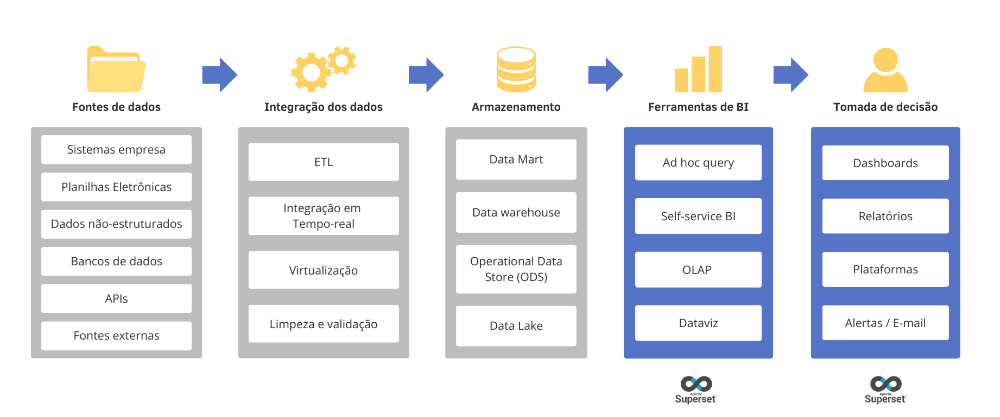

<small>
<a href="https://www.techtarget.com/searchbusinessanalytics/definition/business-intelligence-architecture">Adaptado de Yasar & Pratt 2024 (techtaget)
</a>
</small>

---

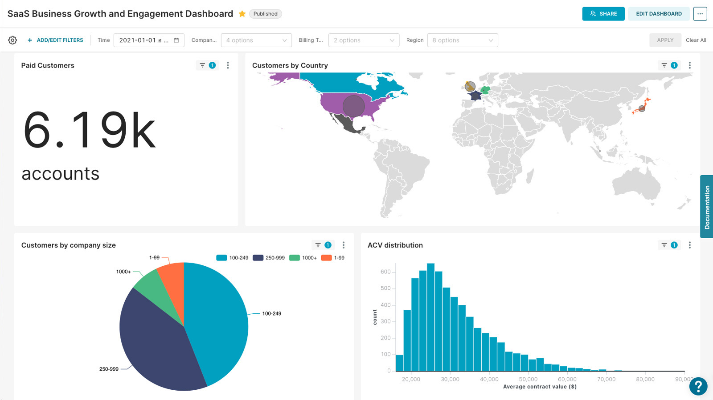

---

No <b>Apache Superset</b>, a análise e visualização de dados ocorrem a partir de <b>conjuntos de dados estruturados</b> – tabelas organizadas em <b>linhas e colunas</b> – extraídas de bancos de dados compatíveis com <b>SQL</b>.

 

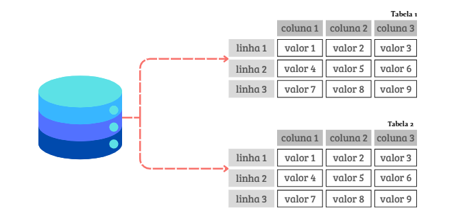

---

Os dados são manipulados e sumarizados para compor <b>visualizações interativas e personalizadas</b>. O <b>Apache Superset</b> oferece <b>mais de 40 tipos de gráficos e visualizações</b>.

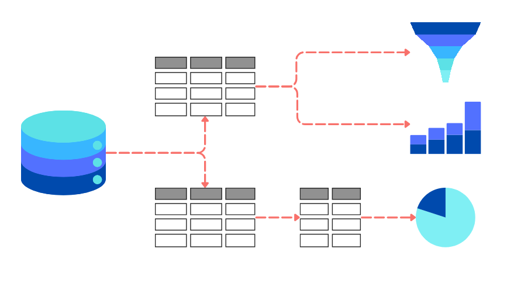

---

<b>Quando os datasets são atualizados na fonte original, o Apache Superset reflete essas mudanças de forma automática</b>, garantindo que as visualizações de dados estejam sempre atualizadas.
 

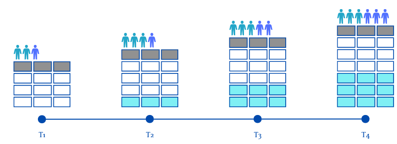

---

As visualizações geradas podem ser organizadas em <b>dashboards interativos</b>, fornecendo uma visão abrangente dos dados com filtros, indicadores e relatórios dinâmicos.
   

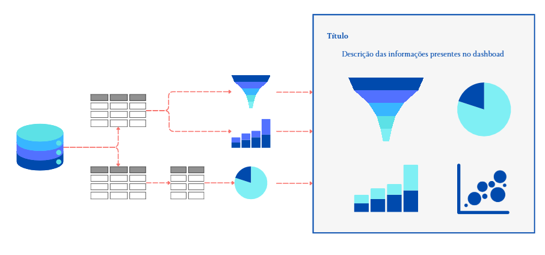

---

Os <b>dashboards</b> podem incluir tabelas e gráficos personalizados, ser exportados como <b>PDFs, imagens ou relatórios automatizados</b> e compartilhados com equipes para acompanhamento de métricas.
 

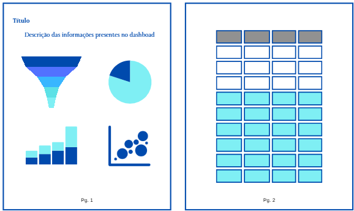

---

 
*Self-serve analytics* para **todos os níveis de usuários**! Oferece um construtor de visualizações e customizações **sem código**.

---

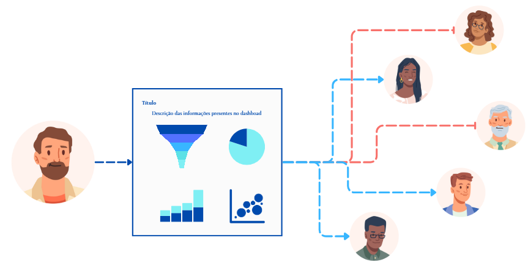

O <b>Apache Superset</b> oferece um sistema de permissões flexível, permitindo a definição de <b>diferentes perfis de usuários</b>, cada um com níveis de acesso e funcionalidades personalizáveis, garantindo controle granular sobre a plataforma.
 

---

A ferramenta é um projeto de <b>código aberto (<i>open-source</i>)</b> e se beneficia de uma grande comunidade de desenvolvedores e usuários que contribuem para a sua melhoria contínua.
 

---
### Workflow

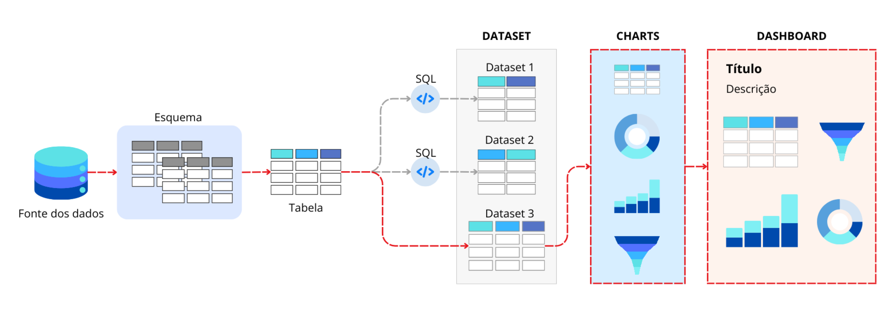

---

### Fonte de dados

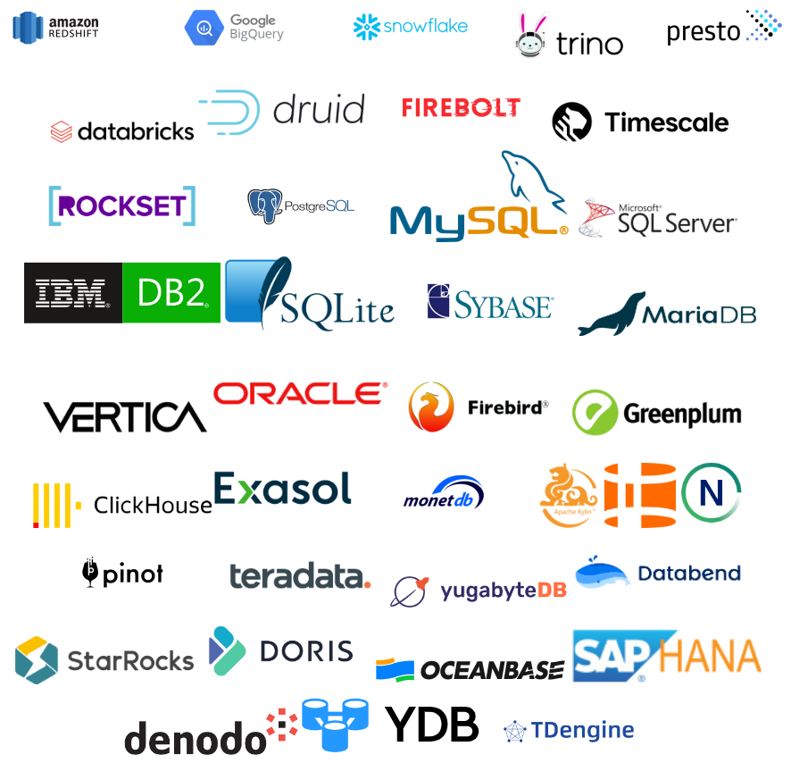  

A ferramenta se conecta a diversas fontes de dados compatíveis com **SQL**, incluindo **Presto, Trino, Athena e muitos outros**.  
<small>
✅ Suporte a **bancos relacionais e data warehouses**  
✅ Compatibilidade depende de **driver Python DB-API**  
✅ Utiliza **SQLAlchemy** para abstração e integração
</small>

---

# História

 - Projeto de hackathon no Airbnb (2015) cujo objetivo era a criação de uma ferramenta para a visualização de dados em código aberto.
 - Cresceu rapidamente e superou o Tableau como principal solução de visualização de dados do Airbnb.
 - Em 2016, Superset tornou-se um projeto de código aberto completo, incubado pela Apache Software Foundation.
 - Empresas como Airbnb, Lyft e Twitter (X) são usuários corporativos do Superset.

  
 Maxime criou o **Apache Superset** para superar as limitações do **Tableau** no Airbnb, que não suportava **Presto** e **Druid**, além de ser caro e pouco escalável. O objetivo era desenvolver uma solução **open-source**, flexível e acessível para análise e visualização de dados. [🔗](https://maximebeauchemin.medium.com/the-future-of-business-intelligence-is-open-source-9b654595773a)

---

<!-- _class: first-slide -->

# Arquitetura

 

"*The Future of Business Intelligence is Open Source*"
<small>Maxime Beauchemin (2021)[🔗](https://maximebeauchemin.medium.com/the-future-of-business-intelligence-is-open-source-9b654595773a)</small>

---

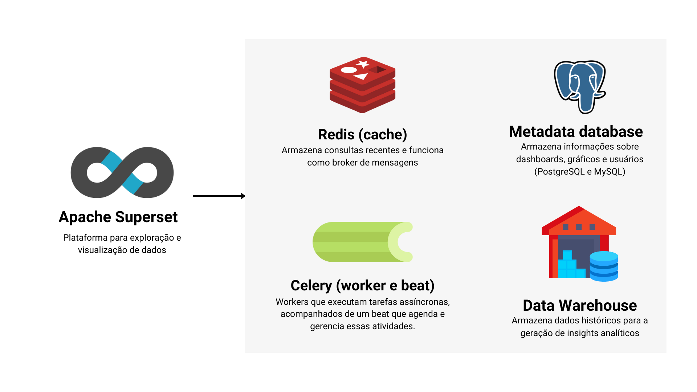

---

### Funcionalidades opcionais

Os componentes opcionais - camada de cache - são necessários para ativar as seguintes funcionalidades:

- **Alertas e Relatórios**
- **Cache**
- **Consultas Assíncronas**
- **Miniaturas de Dashboards (Thumbnails)**

  
 Se você fizer a instalação utilizando Docker Compose ou Kubernets, todos esses componentes serão criados automaticamente.

---

<!-- _class: first-slide -->

# A ferramenta

 

"*The Future of Business Intelligence is Open Source*"
<small>Maxime Beauchemin (2021)[🔗](https://maximebeauchemin.medium.com/the-future-of-business-intelligence-is-open-source-9b654595773a)</small>

---

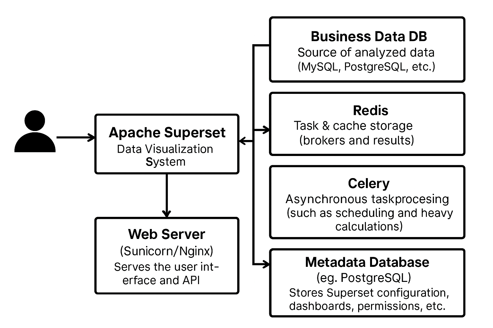

Made by ChatGPT

---

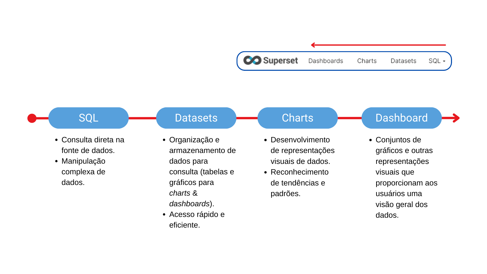

---
<!-- Texto Principal -->

Obrigada!

<!-- Linha Divisória -->

  <b>Marília Melo Favalesso - PhD, Cientista de Dados<b>

<!-- Redes Sociais -->

  <a href="https://www.linkedin.com/in/seuusuario" target="_blank">🔗 LinkedIn: /mariliafavalesso</a>
  <a href="mailto:seuemail@example.com">✉️ Email: marilia.melo.favalesso@gmail.com</a>

